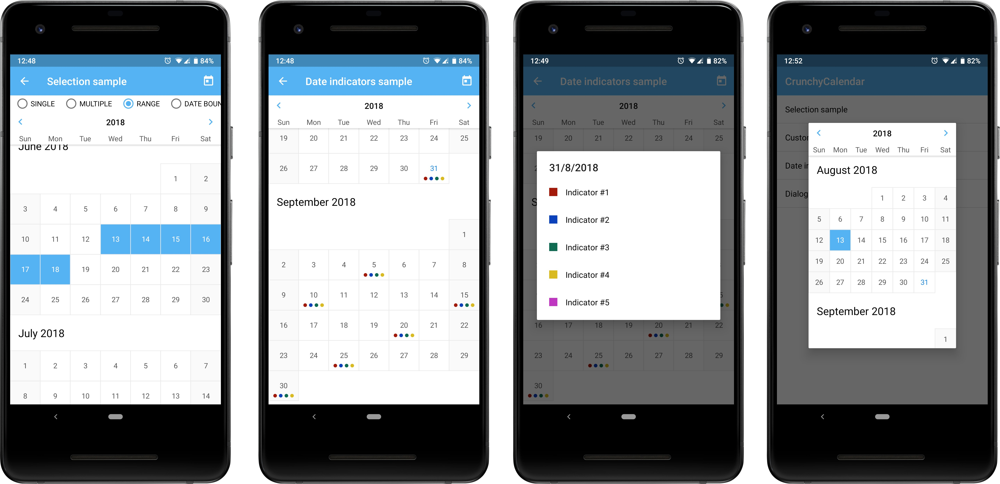

# Calendar

Calendar widget that allow displaying calendar grid, selecting dates, displaying color indicators for specific dates and handling date selection with custom action.



# Sample of usage

First of all, you should declare `CalendarView` in your lyout XML file:

```xml
  <ru.cleverpumpkin.calendar.CalendarView 
        android:id="@+id/calendar_view"
        android:layout_width="match_parent"
        android:layout_height="match_parent" />
```

In the code perform calendar widget seting up.

```kotlin

val calendarView = view.findViewById(R.id.calendar_view)
val calendar = Calendar.getInstance()

// Initial date
calendar.set(2018, Calendar.JUNE, 1)
val initialDate = CalendarDate(calendar.time)

// Minimum available date
calendar.set(2018, Calendar.MAY, 15)
val minDate = CalendarDate(calendar.time)

// Maximum available date
calendar.set(2018, Calendar.JULY, 15)
val maxDate = CalendarDate(calendar.time)

// Set up calendar
calendarView.setupCalendar(
    initialDate = initialDate,
    minDate = minDate,
    maxDate = maxDate,
    selectionMode = SelectionMode.NON,
    selectedDates = emptyList()
)
                
```

# Calendar state 
Calendar widget is able to save and restore its internal state (selected dates, selection mode, etc.), so no needs to call `setupCalendar()` method every time, when `Activity` or `Fragment` recreated. 

If Calendar was set up with `setupCalendar()` method **before** state restoring, previous saved state will be ignored. 

# Calendar selection mode
Calendar widget supports several selection mods for dates selecting: **single**, **multiple** and **range**.

### Single date selection 
Only one date will be selectable. If there is already a selected date and you select a new one or the same, the old date    will be unselected.

```kotlin

val calendarView = view.findViewById(R.id.calendar_view)

// Set up calendar with SelectionMode.SINGLE
calendarView.setupCalendar(selectionMode = SelectionMode.SINGLE)

```

### Multiple date selection 
Multiple dates will be selectable. Selecting an already selected date will unselect it.

```kotlin

val calendarView = view.findViewById(R.id.calendar_view)

// Set up calendar with SelectionMode.MULTIPLE
calendarView.setupCalendar(selectionMode = SelectionMode.MULTIPLE)

```

### Range date selection 
Allows you to select a date range. Previous selections are cleared when you select another date.

```kotlin

val calendarView = view.findViewById(R.id.calendar_view)

// Set up calendar with SelectionMode.RANGE
calendarView.setupCalendar(selectionMode = SelectionMode.RANGE)

```

# Color indicators
Calendar widget is able to display simple color indicators on the date cell.

```kotlin

val calendarView = view.findViewById(R.id.calendar_view)

// Set up calendar
calendarView.setupCalendar()

// Set List of indicators that will be displayed on the calendar.
val indicators: List<DateIndicator> = generateDatesIndicators()
calendarView.datesIndicators = indicators

````

To display any object as color indicator, this object should implement `DateIndicator` interface.

```kotlin

interface DateIndicator {
    val date: CalendarDate
    val color: Int
}

```


